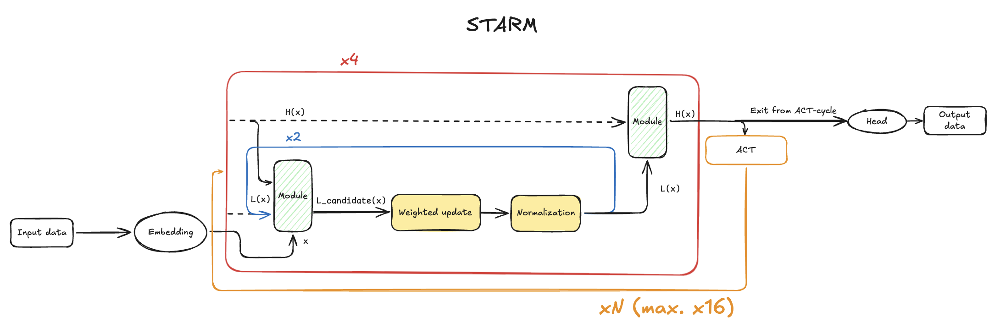
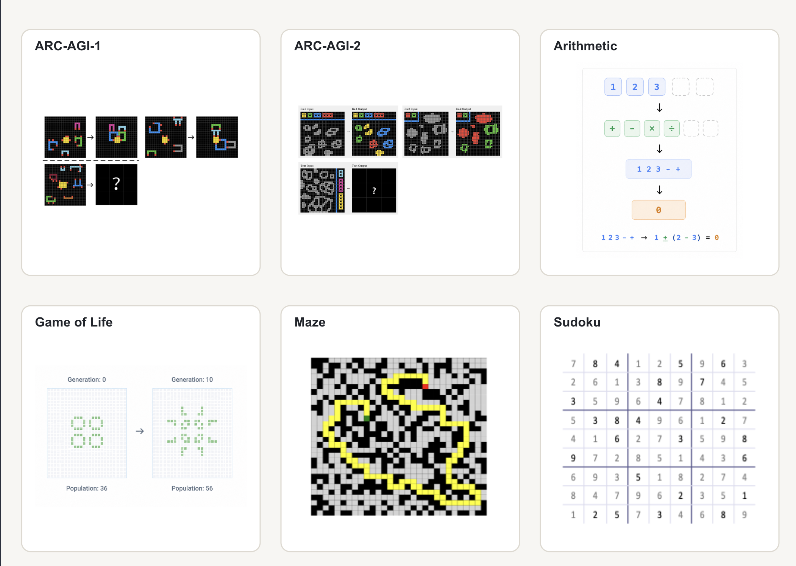
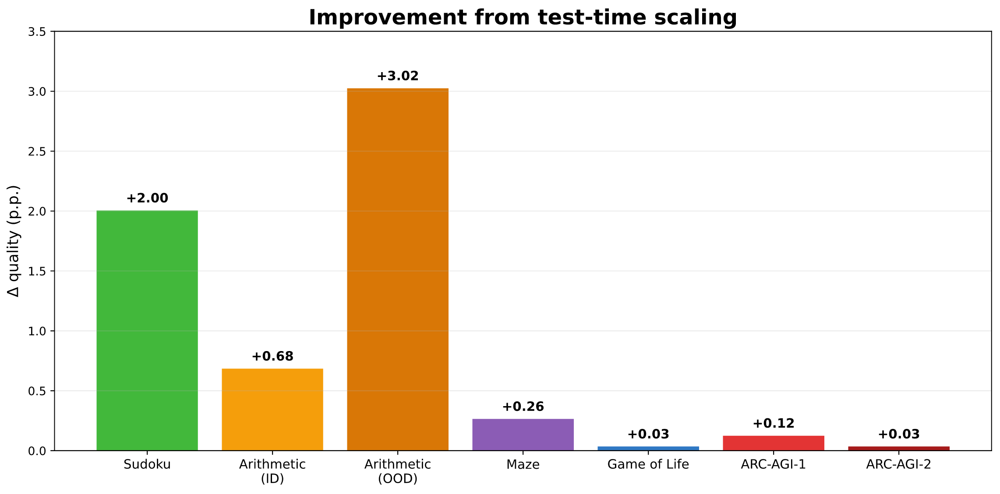

# STARM: Single Task Algorithmic Reasoning Models

STARM is a recurrent architecture for solving algorithmic tasks. A small model repeatedly applies the same computational
block, gradually refining the latent representation of the solution. This approach makes it possible to outperform models
with substantially more parameters on tasks that require strict adherence to an algorithm.



Key results: STARM outperforms a specialized transformer of the same size and shows a better ability to generalize
beyond the training distribution. Across several domains the model outperforms LLMs with substantially more parameters.

📖 [Full version of the article (in Russian)](https://habr.com/ru/companies/sberbank/articles/1069794/)

🇷🇺 [README in Russian](./README_rus.md) | 🇨🇳 [中文 README](./README_zh.md)

## Supported tasks

| Domain     | Task                                                |
|------------|-----------------------------------------------------|
| ARC-AGI-1  | Finding abstract patterns and transformations       |
| ARC-AGI-2  | Solving harder abstract reasoning tasks             |
| Arithmetic | Recovering a sequence of arithmetic operations      |
| Game of Life | Predicting cellular automaton states                |
| Maze       | Finding the shortest path through a maze            |
| Sudoku     | Filling in a grid subject to constraints            |



## Quick start 🚀

### Requirements

The project ships with a [`dockerfile`](./dockerfile) and [`requirements.txt`](./requirements.txt). We recommend setting
up the environment in a container:

```bash
docker build -t starm .
```

To install without Docker, run:

```bash
pip install -r requirements.txt
```

### ClearML integration 📈

[ClearML](https://clear.ml/docs/latest/docs/) is used for experiment tracking and metric visualization. Set your
credentials before launching:

```bash
export CLEARML_API_ACCESS_KEY=<access-key>
export CLEARML_API_SECRET_KEY=<secret-key>
```

### Data preparation

#### Getting the raw data

Initialize the Git submodules with the ARC-AGI datasets:

```bash
git submodule update --init --recursive
```

Generate the raw data for the synthetic domains:

```bash
python dataset/raw-data/arithmetic.py
python dataset/raw-data/game_of_life.py
```

The data for mazes and sudoku is downloaded automatically during dataset preparation (
see [below](#building-the-datasets)).

### Building the datasets

ARC-AGI-1, including the official ARC set and ConceptARC:

```bash
python dataset/build_arc_dataset.py
```

ARC-AGI-2:

```bash
python dataset/build_arc_dataset.py \
  --dataset-dirs dataset/raw-data/ARC-AGI-2/data \
  --output-dir data/arc-2-aug-1000
```

The remaining domains:

```bash
python dataset/build_sudoku_dataset.py
python dataset/build_maze_dataset.py
python dataset/build_arithmetic_dataset.py
python dataset/build_gol_dataset.py
```

The preparation scripts create training and test splits in `.npy` format.

### Training

The base training configuration lives in [`config/cfg_pretrain.yaml`](./config/cfg_pretrain.yaml). The architectures are
described in [`config/arch`](./config/cfg_pretrain.yaml):

- [`dense.yaml`](./config/arch/dense.yaml) — vanilla Transformer;
- [`hrm_v1.yaml`](./config/arch/hrm_v1.yaml) — baseline HRM;
- [`hrm_v2DG.yaml`](./config/arch/hrm_v2DG.yaml) — TRM/URM/STARM configuration.

Ready-made configurations for each domain–model pair live in `experiments/<domain>/`.

Example of launching STARM training on the Game of Life task:

```bash
python pretrain.py --config-dir=experiments/game_of_life --config-name=STARM
```

The same pattern applies to the other domains and architectures.

### Evaluation

During training the model is automatically evaluated on the prepared test sets. This makes it possible to track both
in-distribution quality and the model's ability to generalize at the same time.

The main metric is `exact accuracy`: a prediction counts as correct only if it **matches the target sequence exactly**.

#### Test-time scaling

To further analyze how the model behaves as the compute budget changes (test-time scaling), use
the [`evaluate.py`](./evaluate.py) script.



Example of a run that adds 128 extra ACT cycles on top of those the model was allowed during training:

```bash
python evaluate.py checkpoint="/path/to/model/step_14640" extra_steps=128
```

Test-time scaling parameters are set through command-line flags.

#### ARC-AGI pass@k

For the final evaluation of models on ARC-AGI, use the [`arc_eval.ipynb`](./arc_eval.ipynb) notebook. It contains the
prediction post-processing and the `pass@k` metric computation.

### Inference

For programmatic inference with a trained model, use [`inference.py`](./inference.py):

```bash
python inference.py \
    --checkpoint /path/to/model/step_14640 \
    --output_dir ./predictions
```

## Project structure

```text
.
├── config/                 # Base parameters and architecture configurations
├── dataset/                # Dataset preparation and raw data
├── experiments/            # Model configurations for each domain
├── models/                 # Architecture, layer, and optimizer implementations
├── arc_eval.ipynb          # Final evaluation on ARC-AGI
├── evaluate.py             # Evaluation
├── inference.py            # Model inference
├── pretrain.py             # Training
├── puzzle_dataset.py       # Task loading and processing
└── requirements.txt        # Python dependencies
```

## License

The terms of use are provided in the [LICENSE](./LICENSE) file. Third-party datasets included in the repository may be
covered by separate licenses.
