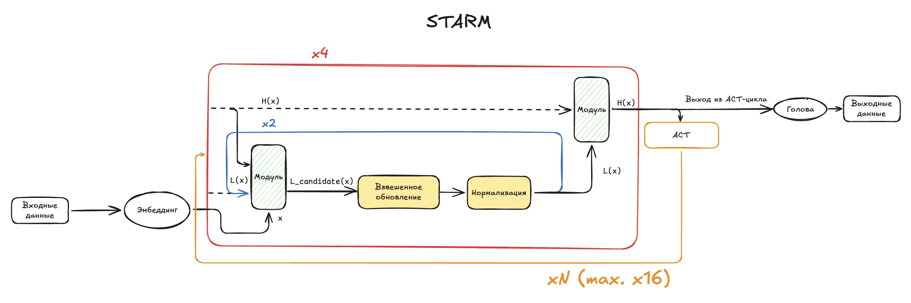
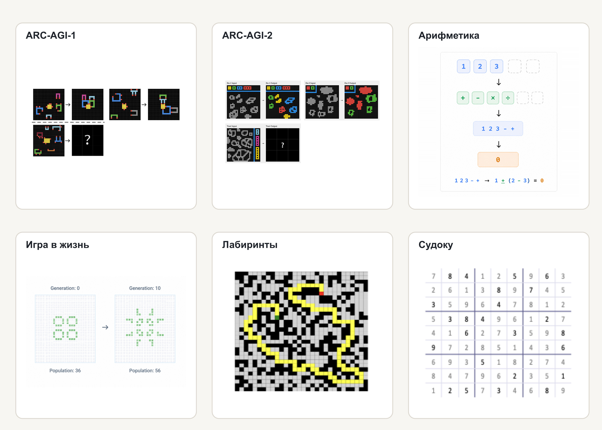
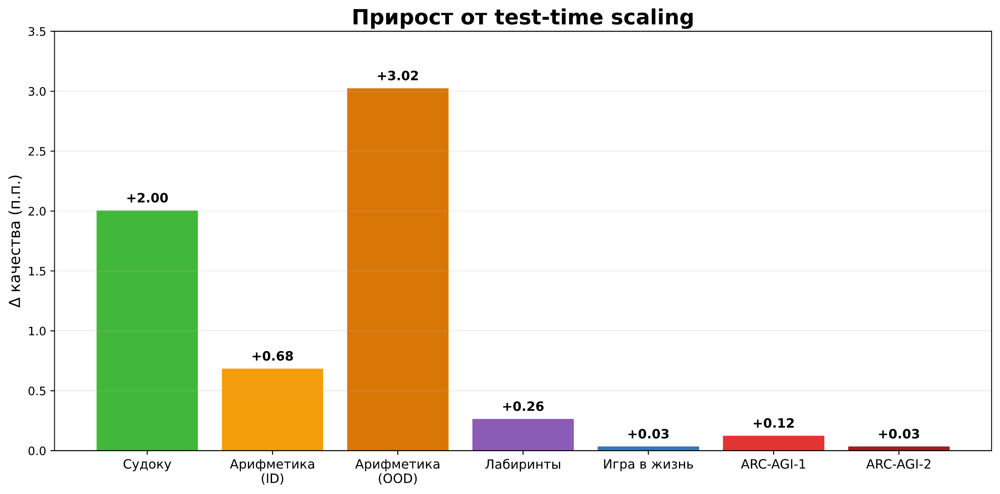

# STARM: Single Task Algorithmic Reasoning Models

STARM - это рекурсивная архитектура для решения алгоритмических задач. Небольшая модель многократно применяет один и тот
же вычислительный блок, постепенно уточняя латентное представление решения. Такой подход позволяет обходить модели с
существенно бо́льшим числом параметров на задачах, требующих строгого следования алгоритму.



Основные результаты: STARM превосходит специализированный трансформер того же размера и демонстрирует лучшую способность
к обобщению за пределы обучающего распределения. На нескольких доменах модель превосходит LLM с существенно бо́льшим
числом параметров.

📖 [Полная версия статьи](https://habr.com/ru/companies/sberbank/articles/1069794/)

🇬🇧 [README на английском](./README.md) | 🇨🇳 [README на китайском](./README_zh.md)

## Поддерживаемые задачи

| Домен        | Задача                                                    |
|--------------|-----------------------------------------------------------|
| ARC-AGI-1    | Поиск абстрактных закономерностей и преобразований        |
| ARC-AGI-2    | Решение усложненных задач на абстрактное мышление         |
| Арифметика   | Восстановление последовательности арифметических операций |
| Игра в жизнь | Предсказание состояний клеточного автомата                |
| Лабиринты    | Поиск кратчайшего пути в лабиринте                        |
| Судоку       | Заполнение сетки с учетом ограничений                     |



## Быстрый старт 🚀

### Требования

Проект распространяется с [`dockerfile`](./dockerfile) и [`requirements.txt`](./requirements.txt). Рекомендуется
развернуть окружение в контейнере:

```bash
docker build -t starm .
```

Для установки без Docker выполните:

```bash
pip install -r requirements.txt
```

### Интеграция с ClearML 📈

Для отслеживания экспериментов и визуализации метрик используется [ClearML](https://clear.ml/docs/latest/docs/). Перед
запуском задайте учётные данные:

```bash
export CLEARML_API_ACCESS_KEY=<access-key>
export CLEARML_API_SECRET_KEY=<secret-key>
```

### Подготовка данных

#### Получение исходных данных

Инициализируйте Git-подмодули с датасетами ARC-AGI:

```bash
git submodule update --init --recursive
```

Сгенерируйте исходные данные для синтетических доменов:

```bash
python dataset/raw-data/arithmetic.py
python dataset/raw-data/game_of_life.py
```

Данные для лабиринтов и судоку будут автоматически загружены при подготовке датасетов (
см. [ниже](#подготовка-датасетов)).

### Подготовка датасетов

ARC-AGI-1, включая официальный набор ARC и ConceptARC:

```bash
python dataset/build_arc_dataset.py
```

ARC-AGI-2:

```bash
python dataset/build_arc_dataset.py \
  --dataset-dirs dataset/raw-data/ARC-AGI-2/data \
  --output-dir data/arc-2-aug-1000
```

Остальные домены:

```bash
python dataset/build_sudoku_dataset.py
python dataset/build_maze_dataset.py
python dataset/build_arithmetic_dataset.py
python dataset/build_gol_dataset.py
```

Скрипты подготовки создают обучающие и тестовые выборки в `.npy` формате.

### Обучение

Базовая конфигурация обучения находится в [`config/cfg_pretrain.yaml`](./config/cfg_pretrain.yaml). Архитектуры описаны
в [`config/arch`](./config/cfg_pretrain.yaml):

- [`dense.yaml`](./config/arch/dense.yaml) — ванильный Transformer;
- [`hrm_v1.yaml`](./config/arch/hrm_v1.yaml) — базовая HRM;
- [`hrm_v2DG.yaml`](./config/arch/hrm_v2DG.yaml) — конфигурация TRM/URM/STARM.

Готовые конфигурации для каждой пары «домен–модель» лежат в `experiments/<domain>/`.

Пример запуска обучения STARM на задаче "Игра в жизнь":

```bash
python pretrain.py --config-dir=experiments/game_of_life --config-name=STARM
```

Аналогично для других доменов и архитектур.

### Оценка качества

Во время обучения модель автоматически оценивается на подготовленных тестовых наборах. Это позволяет одновременно
отслеживать качество внутри обучающего распределения и способность модели к обобщению.

Основная метрика — `exact accuracy`: предсказание считается правильным только при **полном совпадении** с целевой
последовательностью.

#### Test‑time scaling

Для дополнительного анализа поведения модели при изменении вычислительного бюджета (test‑time scaling) используйте
скрипт [`evaluate.py`](./evaluate.py).



Пример запуска при добавлении 128 дополнительных ACT-циклов к тем, что были разрешены модели при обучении:

```bash
python evaluate.py checkpoint="/path/to/model/step_14640" extra_steps=128
```

Параметры test‑time scaling задаются флагами командной строки.

#### ARC-AGI pass@k

Для финальной оценки моделей на ARC-AGI используйте ноутбук [`arc_eval.ipynb`](./arc_eval.ipynb). Он содержит обработку
предсказаний и расчет метрики `pass@k`.

### Инференс

Для программного инференса готовой модели используйте [`inference.py`](./inference.py):

```bash
python inference.py \
    --checkpoint /path/to/model/step_14640 \
    --output_dir ./predictions
```

## Структура проекта

```text
.
├── config/                 # Базовые параметры и конфигурации архитектур
├── dataset/                # Подготовка датасетов и исходные данные
├── experiments/            # Конфигурации моделей для каждого домена
├── models/                 # Реализации архитектур, слоев и оптимизаторов
├── arc_eval.ipynb          # Финальная оценка на ARC-AGI
├── evaluate.py             # Оценка качества
├── inference.py            # Инференс модели
├── pretrain.py             # Обучение
├── puzzle_dataset.py       # Загрузка и обработка задач
└── requirements.txt        # Python-зависимости
```

## Лицензия

Условия использования проекта приведены в файле [LICENSE](./LICENSE). Для входящих в репозиторий сторонних датасетов
могут действовать отдельные лицензии.