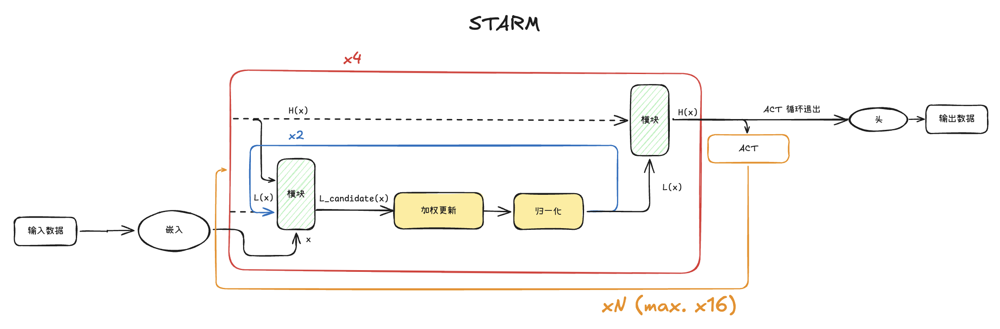
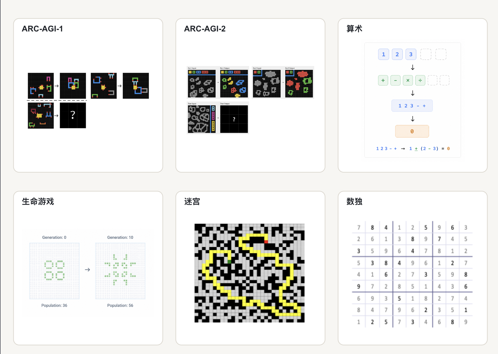
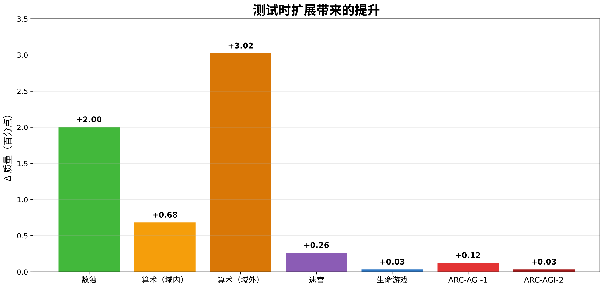

# STARM: Single Task Algorithmic Reasoning Models

STARM 是一种用于求解算法类任务的循环架构。一个小型模型反复应用同一个计算块，逐步细化解的潜在表示。这种方式使其能够在需要严格遵循算法的任务上，超越参数量大得多的模型。



主要结果：STARM 超越了同等规模的专用 Transformer，并展现出更强的分布外泛化能力。在多个领域中，该模型的表现优于参数量大得多的 LLM。

📖 [文章完整版（俄文）](https://habr.com/ru/companies/sberbank/articles/1069794/)

🇬🇧 [英文 README](./README.md) | 🇷🇺 [俄文 README](./README_rus.md)

## 支持的任务

| 领域           | 任务                |
|--------------|-------------------|
| ARC-AGI-1    | 寻找抽象规律与变换         |
| ARC-AGI-2    | 求解更难的抽象推理任务       |
| 算术           | 还原一串算术运算          |
| 生命游戏         | 预测细胞自动机的状态        |
| 迷宫           | 寻找穿越迷宫的最短路径       |
| 数独           | 在约束条件下填充网格        |



## 快速开始 🚀

### 环境要求

项目附带 [`dockerfile`](./dockerfile) 与 [`requirements.txt`](./requirements.txt)。建议在容器中搭建环境：

```bash
docker build -t starm .
```

若不使用 Docker，可执行：

```bash
pip install -r requirements.txt
```

### ClearML 集成 📈

实验跟踪与指标可视化使用 [ClearML](https://clear.ml/docs/latest/docs/)。启动前请设置凭据：

```bash
export CLEARML_API_ACCESS_KEY=<access-key>
export CLEARML_API_SECRET_KEY=<secret-key>
```

### 数据准备

#### 获取原始数据

初始化包含 ARC-AGI 数据集的 Git 子模块：

```bash
git submodule update --init --recursive
```

为合成领域生成原始数据：

```bash
python dataset/raw-data/arithmetic.py
python dataset/raw-data/game_of_life.py
```

迷宫与数独的数据会在构建数据集时自动下载（见[下文](#构建数据集)）。

### 构建数据集

ARC-AGI-1，包含官方 ARC 数据集与 ConceptARC：

```bash
python dataset/build_arc_dataset.py
```

ARC-AGI-2：

```bash
python dataset/build_arc_dataset.py \
  --dataset-dirs dataset/raw-data/ARC-AGI-2/data \
  --output-dir data/arc-2-aug-1000
```

其余领域：

```bash
python dataset/build_sudoku_dataset.py
python dataset/build_maze_dataset.py
python dataset/build_arithmetic_dataset.py
python dataset/build_gol_dataset.py
```

准备脚本会生成 `.npy` 格式的训练集与测试集。

### 训练

基础训练配置位于 [`config/cfg_pretrain.yaml`](./config/cfg_pretrain.yaml)。各架构在 [`config/arch`](./config/cfg_pretrain.yaml)
中描述：

- [`dense.yaml`](./config/arch/dense.yaml) —— 原版 Transformer；
- [`hrm_v1.yaml`](./config/arch/hrm_v1.yaml) —— 基线 HRM；
- [`hrm_v2DG.yaml`](./config/arch/hrm_v2DG.yaml) —— TRM/URM/STARM 配置。

每个「领域–模型」组合的现成配置位于 `experiments/<domain>/`。

在「生命游戏」任务上启动 STARM 训练的示例：

```bash
python pretrain.py --config-dir=experiments/game_of_life --config-name=STARM
```

其他领域与架构同理。

### 评估

训练过程中，模型会自动在准备好的测试集上评估。这样可以同时跟踪分布内的质量与模型的泛化能力。

主要指标是 `exact accuracy`：只有当预测与目标序列**完全一致**时才算正确。

#### 测试时扩展（test-time scaling）

若要进一步分析模型在计算预算变化时的表现（test-time scaling），请使用 [`evaluate.py`](./evaluate.py) 脚本。



在训练时允许的 ACT 循环之上再增加 128 个循环的运行示例：

```bash
python evaluate.py checkpoint="/path/to/model/step_14640" extra_steps=128
```

test-time scaling 的参数通过命令行标志设置。

#### ARC-AGI pass@k

在 ARC-AGI 上对模型做最终评估时，请使用 [`arc_eval.ipynb`](./arc_eval.ipynb) notebook。其中包含预测的后处理与 `pass@k` 指标的计算。

### 推理

如需以编程方式使用已训练的模型进行推理，请使用 [`inference.py`](./inference.py)：

```bash
python inference.py \
    --checkpoint /path/to/model/step_14640 \
    --output_dir ./predictions
```

## 项目结构

```text
.
├── config/                 # 基础参数与架构配置
├── dataset/                # 数据集准备与原始数据
├── experiments/            # 各领域的模型配置
├── models/                 # 架构、层与优化器实现
├── arc_eval.ipynb          # ARC-AGI 上的最终评估
├── evaluate.py             # 评估
├── inference.py            # 模型推理
├── pretrain.py             # 训练
├── puzzle_dataset.py       # 任务加载与处理
└── requirements.txt        # Python 依赖
```

## 许可证

使用条款见 [LICENSE](./LICENSE) 文件。仓库中包含的第三方数据集可能受各自独立的许可证约束。

## 参考文献

STARM 的方法建立在以下工作之上：

- **HRM** —— Guan Wang 等，*Hierarchical Reasoning Model*（2025）
  —— [arXiv:2506.21734](https://arxiv.org/abs/2506.21734) | [代码](https://github.com/sapientinc/HRM)
- **TRM** —— Alexia Jolicoeur-Martineau，*Less is More: Recursive Reasoning with Tiny Networks*（2025）
  —— [arXiv:2510.04871](https://arxiv.org/abs/2510.04871) | [代码](https://github.com/SamsungSAILMontreal/TinyRecursiveModels)
- **URM** —— Zitian Gao 等，*Universal Reasoning Model*（2025）
  —— [arXiv:2512.14693](https://arxiv.org/abs/2512.14693) | [代码](https://github.com/UbiquantAI/URM)
